This is a **[PyTorch](https://pytorch.org) Tutorial to Super-Resolution**.

This is also a tutorial for learning about **GANs** and how they work, regardless of intended task or application.

This is the fifth in [a series of tutorials](https://github.com/sgrvinod/Deep-Tutorials-for-PyTorch) I'm writing about _implementing_ cool models on your own with the amazing PyTorch library.

Basic knowledge of PyTorch, convolutional neural networks is assumed.

If you're new to PyTorch, first read [Deep Learning with PyTorch: A 60 Minute Blitz](https://pytorch.org/tutorials/beginner/deep_learning_60min_blitz.html) and [Learning PyTorch with Examples](https://pytorch.org/tutorials/beginner/pytorch_with_examples.html).

Questions, suggestions, or corrections can be posted as [issues](https://github.com/sgrvinod/a-PyTorch-Tutorial-to-Super-Resolution/issues).

I'm using `PyTorch 1.4` in `Python 3.6`.

# Contents

[***Objective***](https://github.com/sgrvinod/a-PyTorch-Tutorial-to-Super-Resolution#objective)

[***Concepts***](https://github.com/sgrvinod/a-PyTorch-Tutorial-to-Super-Resolution#concepts)

[***Overview***](https://github.com/sgrvinod/a-PyTorch-Tutorial-to-Super-Resolution#overview)

[***Implementation***](https://github.com/sgrvinod/a-PyTorch-Tutorial-to-Super-Resolution#implementation)

[***Training***](https://github.com/sgrvinod/a-PyTorch-Tutorial-to-Super-Resolution#training)

[***Evaluation***](https://github.com/sgrvinod/a-PyTorch-Tutorial-to-Super-Resolution#evaluation)

[***Inference***](https://github.com/sgrvinod/a-PyTorch-Tutorial-to-Super-Resolution#inference)

[***Frequently Asked Questions***](https://github.com/sgrvinod/a-PyTorch-Tutorial-to-Super-Resolution#frequently-asked-questions)

# Objective

**To build a model that can realistically increase image resolution.**

Super-resolution (SR) models essentially hallucinate new pixels where previously there were none. In this tutorial, we will try to _quadruple_ the dimensions of an image i.e. increase the number of pixels by 16x!

We're going to be implementing [_Photo-Realistic Single Image Super-Resolution Using a Generative Adversarial Network_](https://arxiv.org/abs/1609.04802). It's not just that the results are very impressive... it's also a great introduction to GANs!

We will train the two models described in the paper — the SRResNet, and the SRGAN which greatly improves upon the former through adversarial training.  

Before you proceed, take a look at some examples generated from low-resolution images not seen during training. _Enhance!_

---

<p align="center">

</p>

---


---


---

<p align="center">

</p>

---
[A **video demo** for the SRGAN!](https://youtu.be/sUhbIdSd6dc)

Since YouTube's compression is likely reducing the video's quality, you can [download the original video file here](https://drive.google.com/drive/folders/12OG-KawSFFs6Pah89V4a_Td-VcwMBE5i?usp=sharing) for best viewing.

[](https://youtu.be/sUhbIdSd6dc)

Make sure to watch in 1080p so that the 4x scaling is not downsampled to a lower value.

---

There are large examples at the [end of the tutorial](https://github.com/sgrvinod/a-PyTorch-Tutorial-to-Super-Resolution#large-examples).

---

# Concepts

* **Super-Resolution**. duh.

* **Residual Connections**. Introduced in the [seminal 2015 paper](https://arxiv.org/abs/1512.03385), residual connections are shortcuts over one or many neural network layers that allow them to learn residual mappings – perturbations to the input that produce the desired output – instead of wholly learning the output itself. Adding these connections, across so-called residual "blocks", greatly increases the optimizability of very deep neural networks. 
  
* **Generative Adversarial Network (GAN)**. From [another groundbreaking paper](https://proceedings.neurips.cc/paper/2014/file/5ca3e9b122f61f8f06494c97b1afccf3-Paper.pdf), GANs are a machine learning framework that pits two networks against each other, i.e., as adversaries. A generative model, called the Generator, seeks to produce some data – in this case, images of a higher resolution – that is identical in its distribution to the training data. A discriminating model, called the Discriminator, seeks to thwart its attempts at forgery by learning to tell real from fake. As either network grows more skilled, its predictions can be used to improve the other. Ultimately, we want the Generator's fictions to be indistinguishable from fact – at least to the human eye.

* **Sub-Pixel Convolution**. An alternative to transposed convolutions commonly used for upscaling images, subpixel convolutions use regular convolutions on lower-resolution feature maps to create new pixels in the form of new image channels, which are then "shuffled" into a higher-resolution image. 
  
* **Perceptual Loss**. This combines MSE-based content loss in a "deep" image space, as opposed to the usual RGB channel-space, and the adversarial loss, which allows the Generator to learn from the rulings of the Discriminator.

# Overview

In this section, I will present an overview of this model. If you're already familiar with it, you can skip straight to the [Implementation](https://github.com/sgrvinod/a-PyTorch-Tutorial-to-Super-Resolution#implementation) section or the commented code.

### Image Upsampling Methods

Image upsampling is basically the process of **artificially increasing its spatial resolution** – the number of pixels that represent the "view" contained in the image. 

**Upsampling an image is a very common application** – it's happening each time you pinch-zoom into an image on your phone or watch a 480p video on your 1080p monitor. You'd be right that there's no AI involved, and you can tell because the image will begin to appear blurry or blocky once you view it at a resolution greater than that it was encoded at. 

Unlike the neural super-resolution that we will attempt in this tutorial, common upsampling methods are not intended to produce high-fidelity estimations of what an image would look like at higher resolution. Rather, they are used because **images constantly need to be resampled in order to display them**. When you want an image to occupy a certain portion of a 1080p screen or be printed to fit A4-sized paper, for example, it'd be a hell of a coincidence if the native resolution of the monitor or printer matched the resolution of the image. While upsampling technically increases the resolution, it remains obvious that it is still effectively a low-resolution, low-detail image that is simply being viewed at a higher resolution, possibly with some smoothing or sharpening.

In fact, images upsampled with these methods can be used as a **proxy for the low-resolution image** to compare with their super-resolved versions both in the paper and in this tutorial. It would be impossible to display a low-resolution image at the same physical size (in inches, on your screen) as the super-resolved image without upsampling it in some way (or downsampling the super-resolved image, which is stupid). 

Let's take a look at some **common upsampling techniques**, shall we?

As a reference image, consider this awesome Samurai logo from *Cyberpunk 2077* [created by Reddit user /u/shapanga](https://reddit.com/r/cyberpunkgame/comments/8rnndi/i_remade_the_jacket_logo_from_the_trailer_feel/), which I'm using here with their permission.

<p align="center">
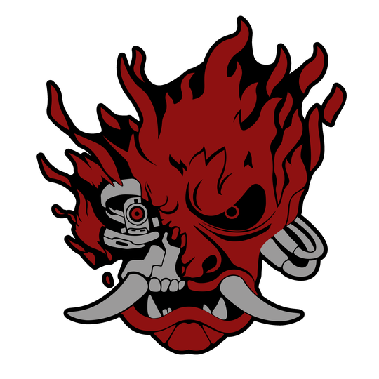
</p>

Consider the same image at quarter dimensions, or sixteen times fewer pixels.

<p align="center">

</p>

The goal is to increase the number of pixels in this low-resolution image so it can be displayed at the same size as its high-resolution counterpart. 

#### Nearest Neighbour Upsampling

This is the simplest way to upsample an image and essentially amounts to stretching the image as-is. 

Consider a small image with a black diagonal line, with red on one side and gray on the other.

<p align="center">
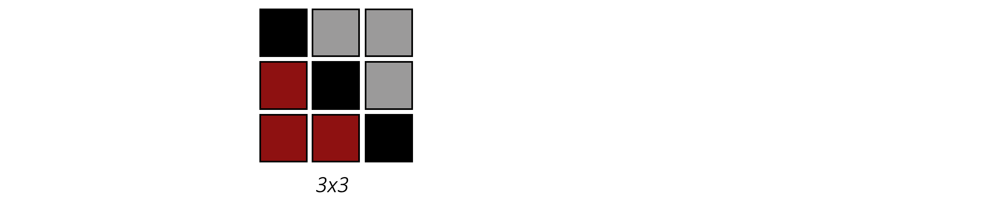
</p>

We first create new, empty pixels between known pixels at the desired resolution.

<p align="center">
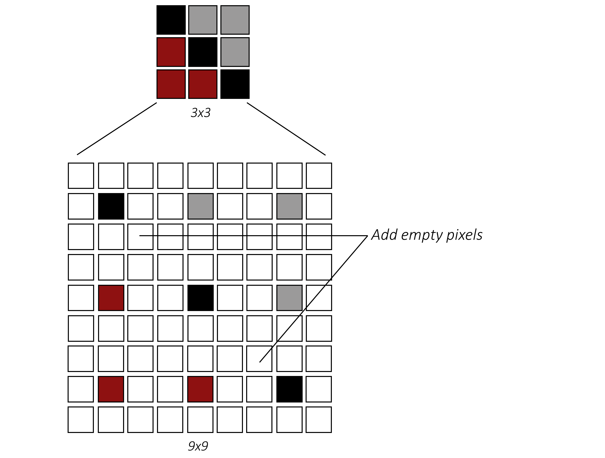
</p>

We then assign each new pixel the **value of its nearest neighbor** whose value we _do_ know.

<p align="center">
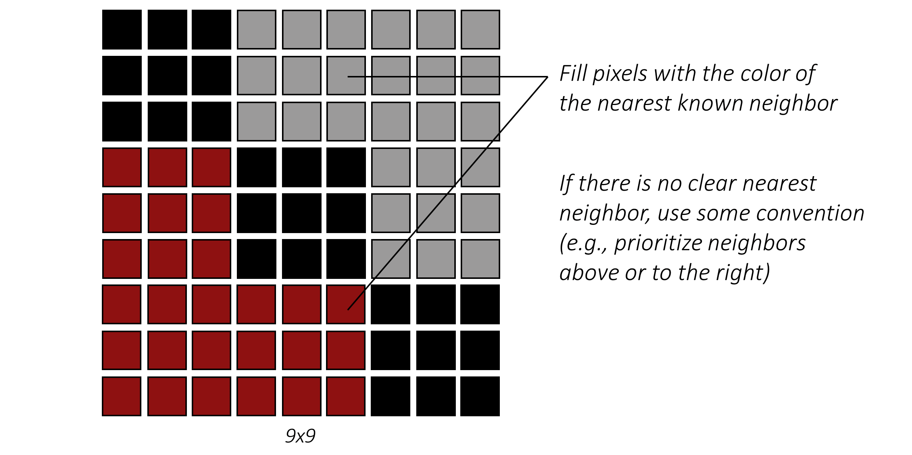
</p>

Upsampling the low-resolution Samurai image using nearest neighbor interpolation yields a result that appears blocky and contains jagged edges. 

<p align="center">

</p>

#### Bilinear / Bicubic Upsampling

Here too, we create empty pixels such that the image is at the target resolution.

<p align="center">

</p>

These pixels must now be painted in. If we perform linear interpolation using the two closest known pixels (i.e., one on each side), it is **_bilinear_ upsampling**.

<p align="center">
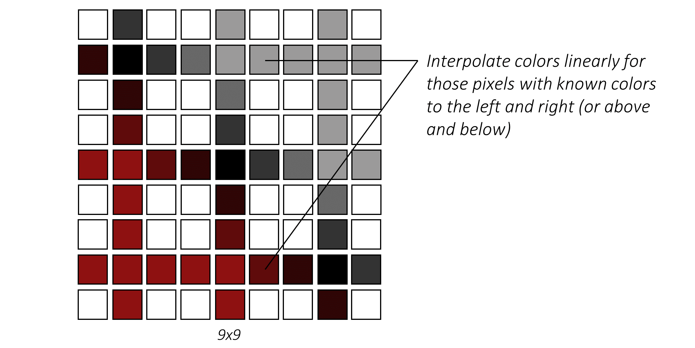
</p>

<p align="center">
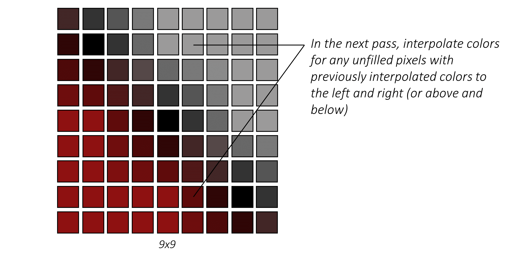
</p>

Upsampling the low-resolution Samurai image using bilinear interpolation yields a result that is smoother than what we achieved using nearest neighbor interpolation, because there is a more natural transition between pixels. 

<p align="center">

</p>

Alternatively, you can perform cubic interpolation using 4 known pixels (i.e., 2 on each side). This would be **_bicubic_ upsampling**. As you can imagine, the result is even smoother because we're using more data to perform the interpolation.

<p align="center">

</p>

[This Wikimedia image](https://commons.wikimedia.org/wiki/File:Comparison_of_1D_and_2D_interpolation.svg) provides a nice snapshot of these interpolation methods.

I would guess that if you're viewing a lower-resolution video on a higher-resolution screen – with the VLC media player, for example – you are seeing individual frames of the video upscaled using either bilinear or bicubic interpolation.

There are other, more advanced upsampling methods such as [Lanczos](https://en.wikipedia.org/wiki/Lanczos_resampling), but my understanding of them is fairly limited. 

### Neural Super-Resolution

In contrast to more "naive" image upsampling, the goal of super-resolution *is* to **create high-resolution, high-fidelity, aesthetically pleasing, plausible images** from the low-resolution version. 

When an image is reduced to a lower resolution, finer details are irretrievably lost. Similarly, **upscaling to a higher resolution requires the _addition_ of new information**. 

As a human, you may be able to visualize what an image might look like at a greater resolution – you might say to yourself, "this blurry mess in this corner would resolve into individual strands of hair", or "that sand-coloured patch might actually be sand and would appear... granular". To manually create such an image yourself, however, would require a certain level of artistry and would no doubt be extremely painstaking. The goal here, in this tutorial, would be to **train a neural network to perform this task**.

A neural network trained for super-resolution might recognize, for instance, that the black diagonal line in our low-resolution patch from above would need to be reproduced as a smooth but sharp black diagonal in the upscaled image.

<p align="center">
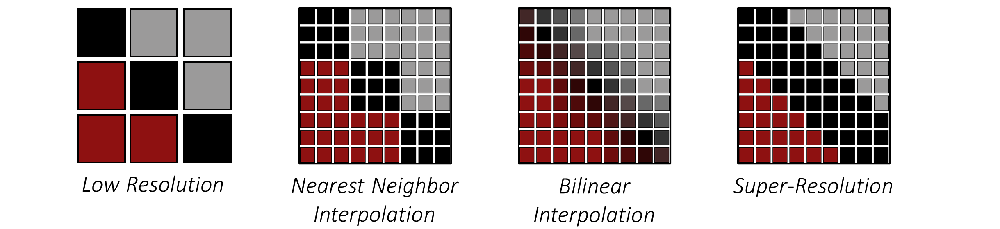
</p>

While neurally super-resolving an image may not be practical (or even necessary) for more mundane tasks, it is already being applied _today_. If you're playing a videogame with [NVIDIA DLSS](https://en.wikipedia.org/wiki/Deep_learning_super_sampling), for example, what's on your screen is being rendered (at lower cost) at a lower resolution and then neurally hallucinated into a larger but crisp image, as if you rendered it at this higher resolution in the first place. The day may not be far when your favorite video player will automatically upscale a movie to 4K as it plays on your humongous TV. 

As stated at the beginning of this tutorial, we will be training two generative neural models – the **SRResNet** and the **SRGAN**. 

Both networks will aim to _quadruple_ the dimensions of an image i.e. increase the number of pixels by 16x!

The low-resolution Samurai image super-resolved with the SRResNet is comparable in quality to the original high-resolution version.

<p align="center">

</p>

And so is the low-resolution Samurai image super-resolved with the SRGAN.

<p align="center">
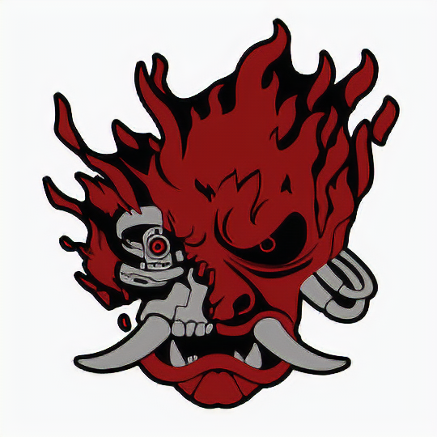
</p>

With the Samurai image, I'd say the SRResNet's result looks better than the SRGAN's. However, this might be because it's a relatively simple image with plain, solid colours – the SRResNet's weakness for producing overly smooth textures works to its advantage in this instance. 

In terms of the ability to create photorealistic images with fine detail, the SRGAN greatly outperforms the SRResNet because of its adversarial training, as evidenced in the various examples peppered throughout this tutorial.

### Residual (Skip) Connections

Generally, **deeper neural networks are more capable** – but only up to a point. It turns out that adding more layers will improve performance but after a certain threshold is reached, **performance will *degrade***. 

This degradation is not caused by overfitting the training data – training metrics are affected as well. Nor is it caused by vanishing or exploding gradients, which you might expect with deep networks, because the problem persists despite normalizing initializations and layer outputs. 

To address this relative unoptimizability of deeper neural networks, in a [seminal 2015 paper](https://arxiv.org/abs/1512.03385), researchers introduced **_skip_ connections** – shortcuts that allow information to flow, unchanged, across an intervening operation. This information is added, element-wise, to the output of the operation.

<p align="center">

</p>

Such a connection need not occur across a single layer. You can create a shortcut across a group of successive layers.

<p align="center">
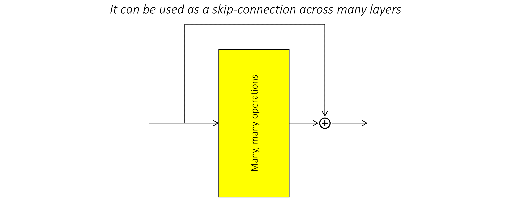
</p>

Skip connections allow intervening layers to **learn a residual mapping instead of learning the unreferenced, desired function in its entirety** – i.e., it would need to model only the changes that must be made to the input to produce the desired output. Thus, while the final result might be the same, what we want these layers to learn has been fundamentally changed.

<p align="center">
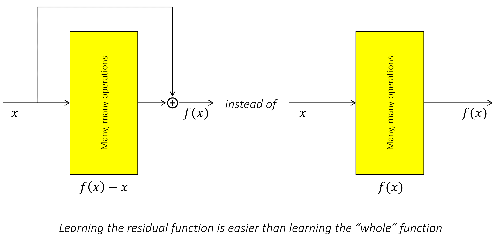
</p>

**Learning the residual mapping is significantly easier**. Consider, for example, the extreme case of having a group of non-linear layers learn the _identity_ mapping. While this may appear to be a simple task at first glance, its solution – i.e. the weights of these layers that linearly transform the input in such a way that applying a non-linear activation produces that same input – isn't obvious, and approximating it is not trivial. In contrast, the solution to learning its residual mapping, which is simply a _zero function_ (i.e., no changes to the input), *is* trivial – the weights must simply be driven to zero. 

It turns out that this particular example _isn't_ as extreme as we think because **deeper layers in a network do learn something not completely unlike the identity function** because only small changes are made to the input by these layers. 

Skip connections allow you to train very deep networks and unlock significant performance gains. It is no surprise that they are used in both the SRResNet (aptly named the Super-Resolution _Residual_ Network) and the Generator of the SRGAN. In fact, you'd be hard-pressed to find a modern network without them. 

### Sub-Pixel Convolution

How is upscaling handled in CNNs? This isn't a task specific to super-resolution, but also to applications like semantic segmentation where the more "global" feature maps, which are by definition at a lower resolution, must be upsampled to the resolution you want to perform the segmentation at. 

A common approach is to **perform bilinear or bicubic upsampling to the target resolution, and _then_ apply convolutions** (which must be learned) to produce a better result. In fact, earlier networks for super-resolution did exactly this – upscale the low-resolution image at the very beginning of the network and then apply a series of convolutional layers in the high-resolution space to produce the final super-resolved image. 

Another popular method is **transposed convolution**, which you may be familiar with, where whole convolutional kernels are applied to single pixels in the low-resolution image and the resulting multipixel patches are combined at the desired stride to produce the high-resolution image. It's basically **the reverse of the usual convolution process**.

**Subpixel convolution** is an alternative approach that involves applying regular convolutions to the low-resolution image such that **the new pixels that we require are created in the form of additional channels**. 

<p align="center">
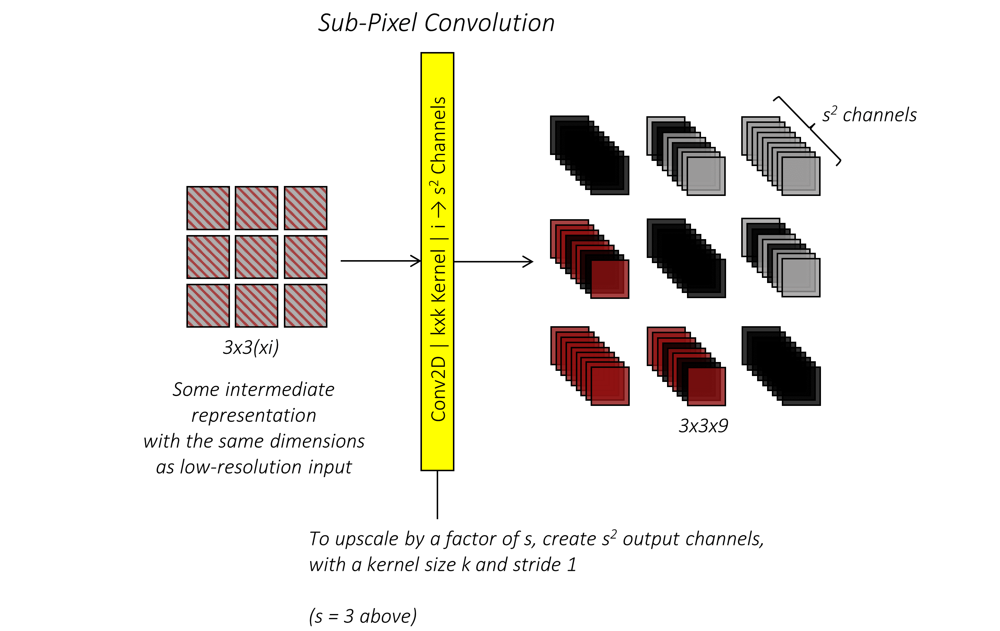
</p>

In other words, **if you want to upsample by a factor $s$**, the $s^2$ new pixels that must be created for each pixel in the low-resolution image are produced by the convolution operation in the form of **$s^2$ new channels** at that location. You may use any kernel size $k$ of your choice for this operation, and the low-resolution image can have any number of input channels $i$.

These channels are then rearranged to yield the high-resolution image, in a process called the **pixel shuffle**.

<p align="center">
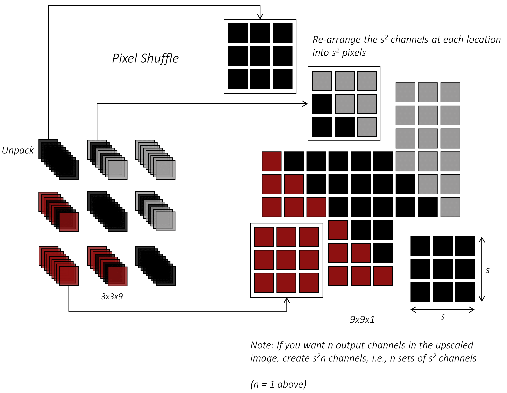
</p>

In the above example, there's only one output channel in the high-resolution image. **If you require $n$ output channels, simply create $n$ sets of $s^2$ channels**, which can be shuffled into $n$ sets of $s * s$ patches at each location. 

In the rest of the tutorial, we will the pixel-shuffle operation as follows –

<p align="center">
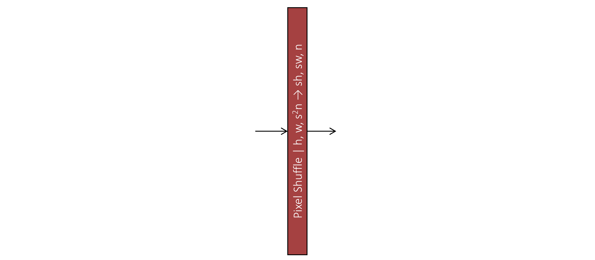
</p>

As you can imagine, **performing convolutions in the low-resolution space is more efficient than doing so at a higher resolution**. Therefore, the subpixel convolution layer is often at the very end of the super-resolution network, *after* a series of convolutions have already been applied to the low-resolution image. 

### Minimizing Loss – a refresher

Let's stop for a moment to examine _why_ we construct loss functions and minimize them. You probably already know all of this, but I think it would help to go over these concepts again because they are key to understanding how GANs are trained. 

<p align="center">
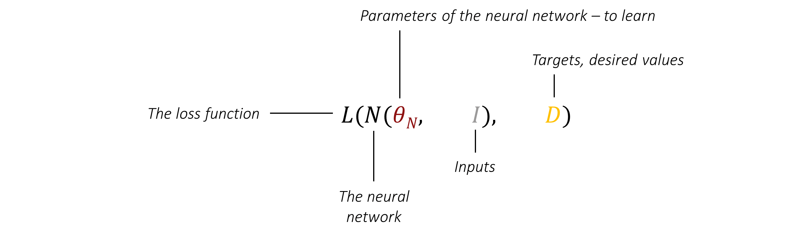
</p>

- A **loss function** $L$ is basically a function that quantifies how _different_ the outputs of our network $N$ are from their desired values $D$. 
  
- Our neural network's outputs $N(θ_N, I)$ are the outputs generated by the network with its current parameter set $θ_N$ when provided an input $I$.
  
- We say _desired_ values $D$, and not gold values or labels, because the values we desire are not necessarily the truth, as we will see later.
  
- The goal then would be to **minimize the loss function**, which we do by changing the network's parameters $θ_N$ in a way that drives its ouptuts $N(θ_N, I)$ towards the desired values $D$. 

<p align="center">
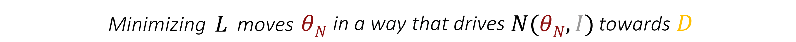
</p>

Keep in mind that the change in the parameters $θ_N$ is not a consequence of minimizing the loss function $L$. Rather, the minimization of the loss function $L$ is a consequence of changing the parameters $θ_N$ in a particular way. Above, I say "Minimizing $L$ *moves* $θ_N$..." simply to indicate that *choosing* to minimize a certain loss function $L$ implies these particular changes to $θ_N$.

_How_ the direction and magnitude of the changes to $θ_N$ are decided is secondary to this particular discussion, but in the interest of completeness – 

- Gradients of the loss function $L$ with respect to the parameters $θ_N$, i.e. $\frac{∂L}{∂θ_N}$ are calculated, by propagating gradients back through the network using the chain rule of differentiation, in a process known as *backpropagation*.
  
- The parameters $θ_N$ are moved in a direction opposite to the gradients $\frac{∂L}{∂θ_N}$ by a magnitude proportional to the magnitude of the gradients $\frac{∂L}{∂θ_N}$ and a step size $lr$ known as the learning rate, thereby descending along the surface of the loss function, in a process known as *gradient descent*.

To conclude, the important takeaway here is that, for a network $N$ given an input $I$, by choosing a suitable loss function $L$ and desired values $D$, it is possible to manipulate all parameters $θ_N$ upstream of the loss function in a way that drives outputs of $N$ closer to $D$. 

Depending upon our requirements, we may choose to manipulate only a subset $θ_n$ of all parameters $θ_N$, by freezing the other parameters $θ_{N-n}$, thereby **training only a subnetwork $n$ in the whole network $N$**, in a way that drives outputs of the subnetwork $n$ in a way which, in turn, drives outputs of the whole network $N$ closer to desired values $D$. 

<p align="center">
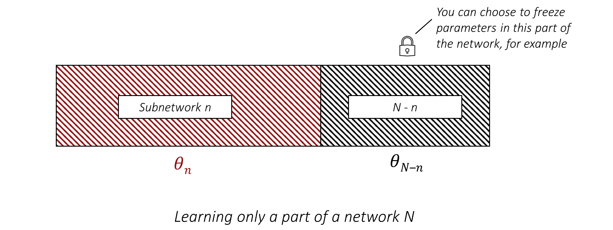
</p>

You may have already done this before in transfer learning applications – for instance, fine-tuning only the final layers $n$ of a large pretrained CNN or Transformer model $N$ to adapt it to a new task. We will do something similar later on, but in an entirely different context.

### The Super-Resolution ResNet (SRResNet)

The SRResNet is a **fully convolutional network designed for 4x super-resolution**. As indicated in the name, it incorporates residual blocks with skip connections to increase the optimizability of the network despite its significant depth. 

The SRResNet is trained and used as a standalone network, and as you will see soon, provides a **nice baseline for the SRGAN** – for both comparision and initialization.

#### The SRResNet Architecture

<p align="center">
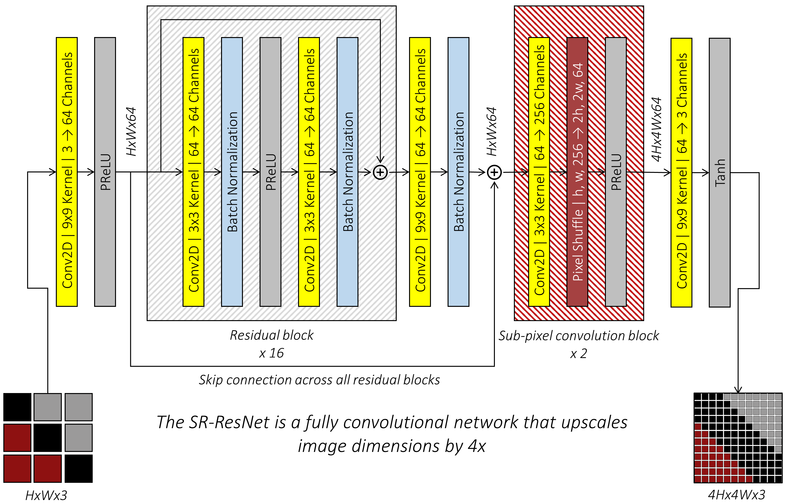
</p>

The SRResNet is composed of the following operations –

- First, the low resolution image is convolved with a large kernel size $9\times9$ and a stride of $1$, producing a feature map at the same resolution but with $64$ channels. A parametric *ReLU* (*PReLU*) activation is applied.
  
- This feature map is passed through $16$ **residual blocks**, each consisting of a convolution with a $3\times3$ kernel and a stride of $1$, batch normalization and *PReLU* activation, another but similar convolution, and a second batch normalization. The resolution and number of channels are maintained in each convolutional layer.
  
- The result from the series of residual blocks is passed through a convolutional layer with a $3\times3$ kernel and a stride of $1$, and batch normalized. The resolution and number of channels are maintained. In addition to the skip connections in each residual block (by definition), there is a larger skip connection arching across all residual blocks and this convolutional layer.
  
- $2$ **subpixel convolution blocks**, each upscaling dimensions by a factor of $2$ (followed by *PReLU* activation), produce a net 4x upscaling. The number of channels is maintained.
  
- Finally, a convolution with a large kernel size $9\times9$ and a stride of $1$ is applied at this higher resolution, and the result is *Tanh*-activated to produce the **super-resolved image with RGB channels** in the range $[-1, 1]$.

If you're wondering about certain specific numbers above, don't worry. As is often the case, they were likely decided either empirically or for convenience by the authors and in the other works they referenced in their paper. 

#### The SRResNet Update

Training the SRResNet, like any network, is composed of a series of updates to its parameters. What might constitute such an update?

Our training data will consist of high-resolution (gold) images, and their low-resolution counterparts which we create by 4x-downsampling them using bicubic interpolation. 

In the forward pass, the SRResNet produces a **super-resolved image at 4x the dimensions of the low-resolution image** that was provided to it. 

<p align="center">
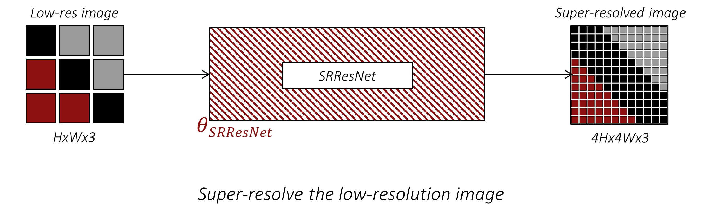
</p>

We use the **Mean-Squared Error (MSE) as the loss function** to compare the super-resolved image with this original, gold high-resolution image that was used to create the low-resolution image.

<p align="center">
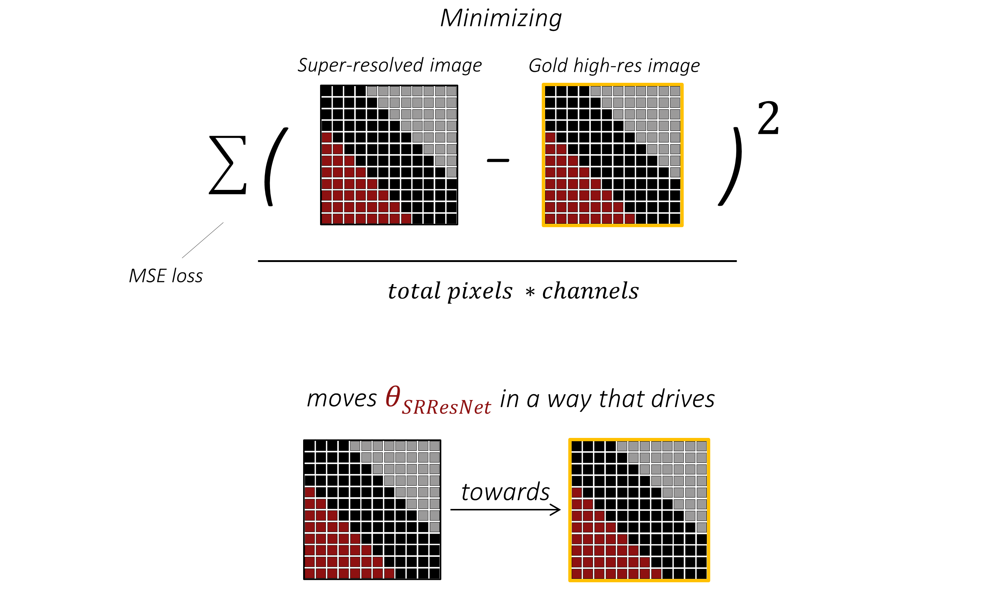
</p>

Choosing to minimize the MSE between the super-resolved and gold images means we will change the parameters of the SRResNet in a way that, if given the low-resolution image again, it will **create a super-resolved image that is closer in appearance to the original high-resolution version**. 

The MSE loss is a type of ***content* loss**, because it is based purely on the contents of the predicted and target images. 

In this specific case, we are considering their contents in the ***RGB space*** – we will discuss the significance of this soon.

### The Super-Resolution Generative Adversarial Network (SRGAN)

The SRGAN consists of a **Generator** network and a **Discriminator** network. 

The goal of the Generator is to learn to super-resolve an image realistically enough that the Discriminator, which is trained to identify telltale signs of such artificial origin, can no longer reliably tell the difference. 

Both networks are **trained in tandem**. 

The Generator learns not only by minimizing a content loss, as in the case of the SRResNet, but also by _spying_ on the Discriminator's methods. 

If you're wondering, _we_ are the mole in the Discriminator's office! By providing the Generator access to the Discriminator's inner workings in the form of the gradients produced therein when backpropagating from its outputs, the Generator can adjust its own parameters in a way that alter the Discriminator's outputs in its favour. 

And as the Generator produces more realistic high-resolution images, we use these to train the Disciminator, improving its disciminating abilities.

#### The Generator Architecture

The Generator is **identical to the SRResNet** in architecture. Well, why not? They perform the same function. This also allows us to use a trained SRResNet to initialize the Generator, which is a huge leg up. 

#### The Discriminator Architecture

As you might expect, the Discriminator is a convolutional network that functions as a **binary image classifier**.

<p align="center">
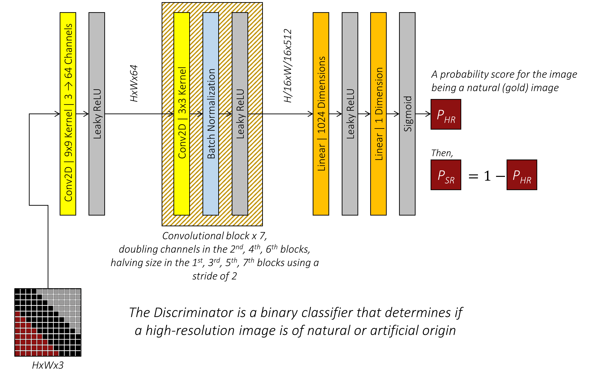
</p>

It is composed of the following operations –

- The high-resolution image (of natural or artificial origin) is convolved with a large kernel size $9\times9$ and a stride of $1$, producing a feature map at the same resolution but with $64$ channels. A leaky *ReLU* activation is applied.
  
- This feature map is passed through $7$ **convolutional blocks**, each consisting of a convolution with a $3\times3$ kernel, batch normalization, and leaky *ReLU* activation. The number of channels is doubled in even-indexed blocks. Feature map dimensions are halved in odd-indexed blocks using a stride of $2$.
  
- The result from this series of convolutional blocks is flattened and linearly transformed into a vector of size $1024$, followed by leaky *ReLU* activation.
  
- A final linear transformation yields a single logit, which can be converted into a probability score using the *Sigmoid* activation function. This indicates the **probability of the original input being a natural (gold) image**.

#### Interleaved Training

First, let's describe how the Generator and Discriminator are trained in relation to each other. Which do we train first? 

Well, neither is fully trained well before the other – they are both trained *together*.

Typically, any GAN is **trained in an interleaved fashion**, where the Generator and Discriminator are alternately trained for short periods of time.

In this particular paper, each component network is updated just once before making the switch.

<p align="center">
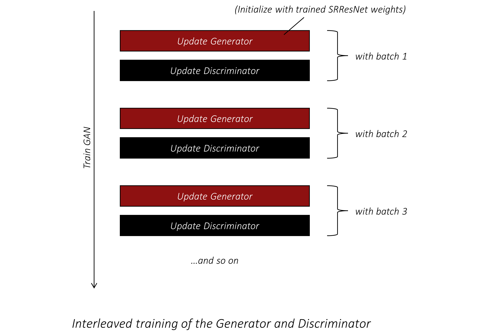
</p>

In other GAN implementations, you may notice there are $k$ updates to the Discriminator for every update to the Generator, where $k$ is a hyperparameter that can be tuned for best results. But often, $k=1$.

#### The Discriminator Update

It's better to understand what constitutes an update to the Discriminator before getting to the Generator. There are no surprises here – it's exactly as you would expect. 

Since the Discriminator will learn to tell apart natural (gold) high-resolution images from those produced by Generator, it is provided both gold and super-resolved images with the corresponding labels ($HR$ vs $SR$) during training.

For example, in the forward pass, the Discriminator is provided with a gold high-resolution image and it produces a **probability score $P_{HR}$ for it being of natural origin**. 

<p align="center">
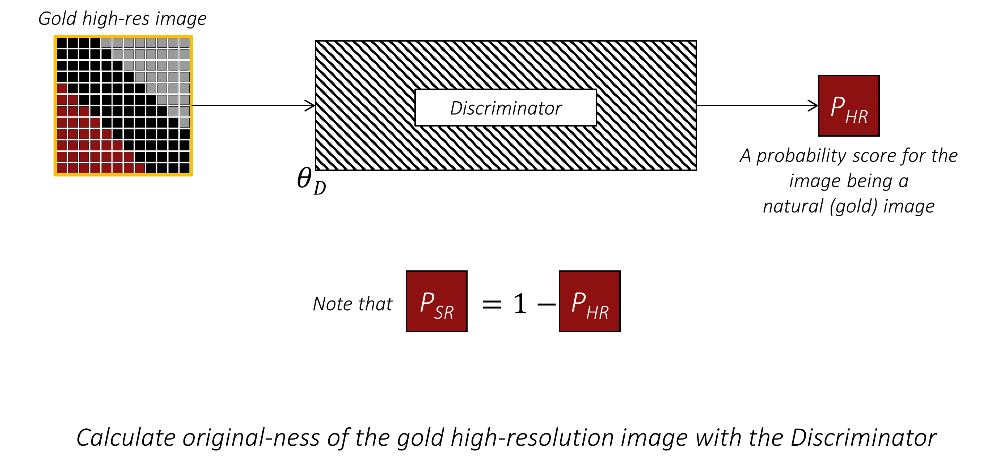
</p>

We desire the Discriminator to be able to correctly identify it as a gold image, and for $P_{HR}$ to be as high as possible. We therefore minimize the **binary cross-entropy loss** with the correct ($HR$) label.

<p align="center">
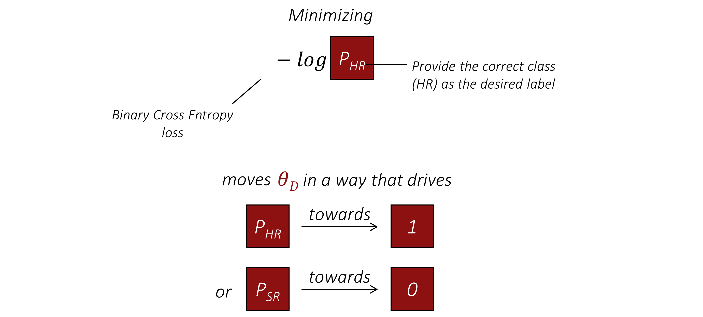
</p>

Choosing to minimize this loss will change the parameters of the Discriminator in a way that, if given the gold high-resolution image again, it will **predict a higher probability $P_{HR}$ for it being of natural origin**. 

Similarly, in the forward pass, the Discriminator is provided with the super-resolved image that the Generator (in its current state) created from the downsampled low-resolution version of the original high-resolution image, and the Discriminator produces a **probability score $P_{HR}$ for it being of natural origin**. 

<p align="center">
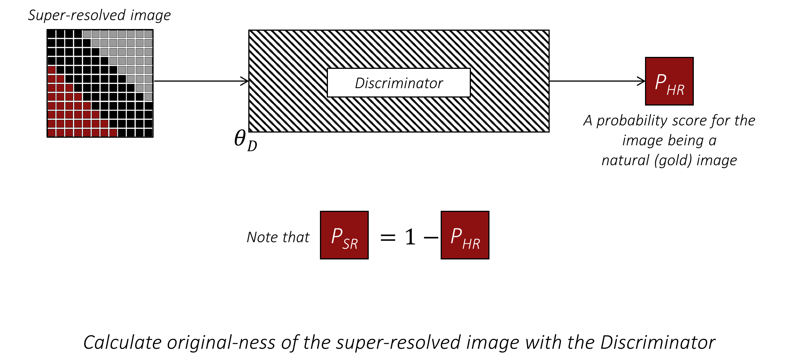
</p>

We desire the Discriminator to be able to correctly identify it as a super-resolved image, and for $P_{HR}$ to be as low as possible. We therefore minimize the **binary cross-entropy loss** with the correct ($SR$) label.

<p align="center">
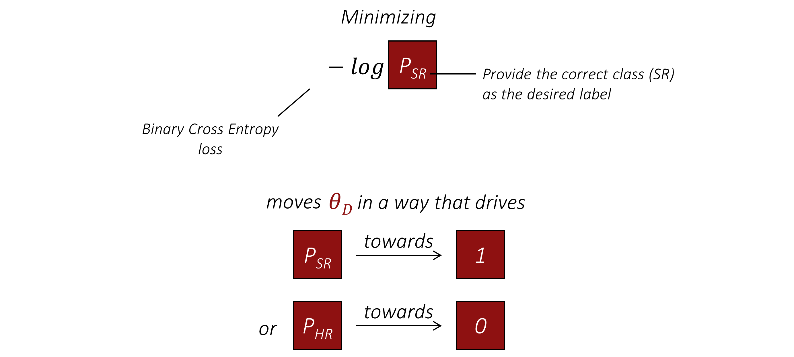
</p>

Choosing to minimize this loss will change the parameters of the Discriminator in a way that, if given the super-resolved image again, it will **predict a lower probability $P_{HR}$ for it being of natural origin**. 

The training of the Discriminator is fairly straightforward, and isn't any different from how you would expect to train any image classifier.

Now, let's look at what constitutes an update to the Generator.

#### A Better Content Loss

The **MSE-based content loss in the RGB space**, as used with the SRResNet, is a staple in the image generation business. 

But it has its drawbacks – it **produces overly smooth images** without the fine detail that is required for photorealism. You may have already noticed this in the results of the SRResNet in the various examples in this tutorial. And it's easy to see why.

When super-resolving a low-resolution patch or image, there are often multiple closely-related possibilities for the resulting high-resolution version. In other words, a small blurry patch in the low-resolution image can resolve itself into a manifold of high-resolution patches that would each be considered a valid result. 

Imagine, for instance, that a low-resolution patch would need to produce a hatch pattern with blue diagonals with a specific spacing at a higher resolution in the RGB space. There are multiple possiblities for the exact positions of these diagonal lines.

<p align="center">
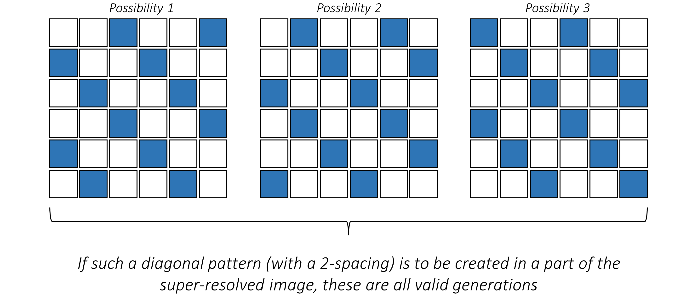
</p>

Any one of these would be considered a satisfying result. Indeed, the natural high-resolution image *will* contain one of them. 

But a network trained with content loss in the RGB space, like the SRResNet, would be quite reluctant to produce such a result. Instead, it opts to produce something that is essentially the ***average* of the manifold of finely detailed high-resolution possibilities.** This, as you can imagine, contains little or no detail because they have all been averaged out! But it *is* a safe prediction because the natural or ground-truth patch it was trained with can be any one of these possibilities, and producing any *other* valid possibility would result in a very high MSE.

<p align="center">
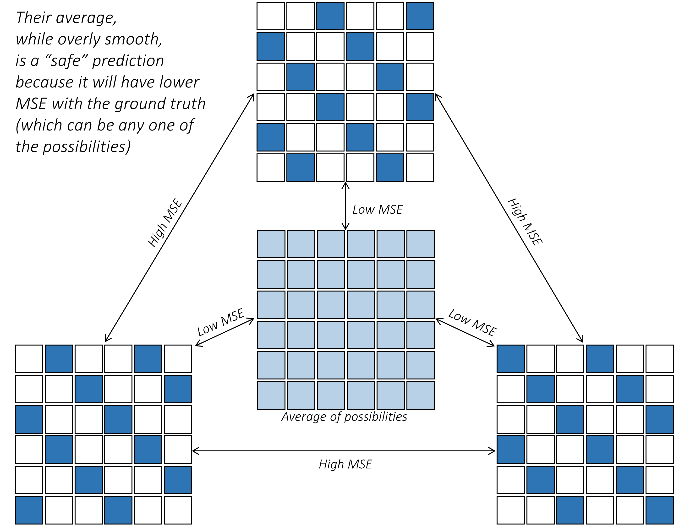
</p>

In other words, the very fact that it is impossible to know from the low-resolution patch the *exact* RGB pixels in the ground-truth patch deters the network from creatively producing any equivalent pattern because there is a high risk of high MSE and a snowball's chance in hell of coincidentally producing the same pixels as the ground-truth patch. Instead, **an overly smooth "averaged" prediction will almost always have lower MSE!** 

In the eyes of the model – remember, the model is *seeing* through the content loss in the RGB space – these many valid possibilities are not equivalent at all. The only valid prediction is producing *the* ground-truth RGB pixels, which are impossible to know exactly. To solve this problem, we need a way to make these many possibilities that are equivalent in our eyes *also* equivalent in the eyes of the model. 

Is there a way to ignore the precise configuration of RGB pixels in a patch or image and instead boil it down it to its basic essence or meaning? *Yes!* CNNs trained to classify images do exactly this – they produce "deeper" representations of the patch or image that describe its nature. It stands to reason that **patterns that are logically equivalent in the RGB space will produce similar representations when passed through a trained CNN.**

<p align="center">
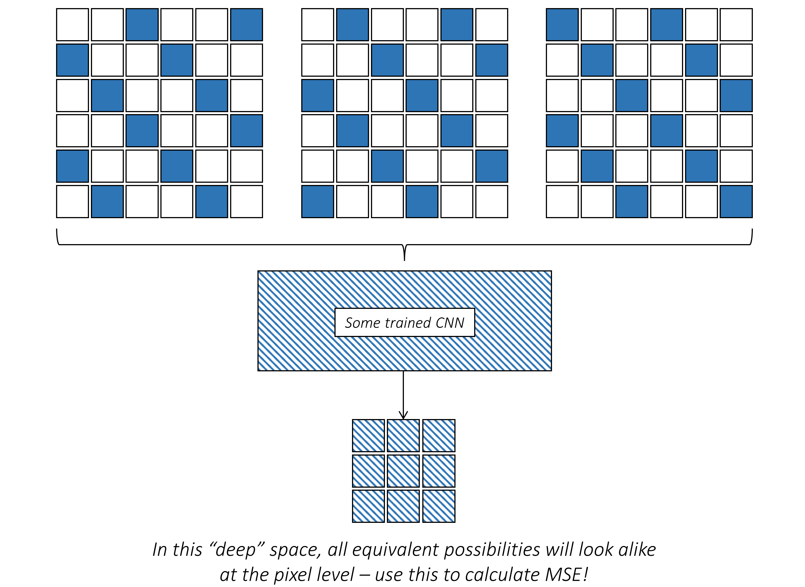
</p>

This new "deep" representation space is much more suitable for calculating a content loss! Our super-resolution model no longer need fear being creative – producing a logical result with fine details that is not exactly the same as the ground-truth in RGB space will not be penalized. 

#### The Generator Update – part 1

The first component of the Generator update involves the ***content* loss**.

As we know, in the forward pass, the Generator produces a **super-resolved image at 4x the dimensions of the low-resolution image** that was provided to it. 

<p align="center">
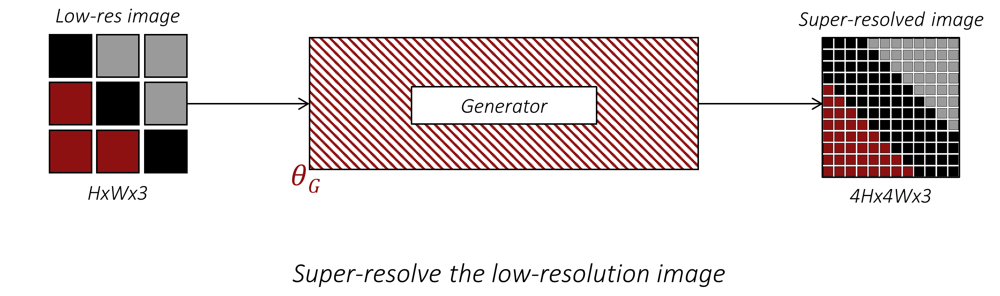
</p>

For the reasons described in the previous section, we will *not* be using MSE in RGB space as the content loss to compare the super-resolved image with the original, gold high-resolution image that was used to create the low-resolution image.

Instead, we will pass both of these through a trained CNN, specifically the **VGG19 network** that has been pretrained on the Imagenet classification task. This network is **truncated at the $4$th convolution after the $5$th maxpooling layer.** 

<p align="center">
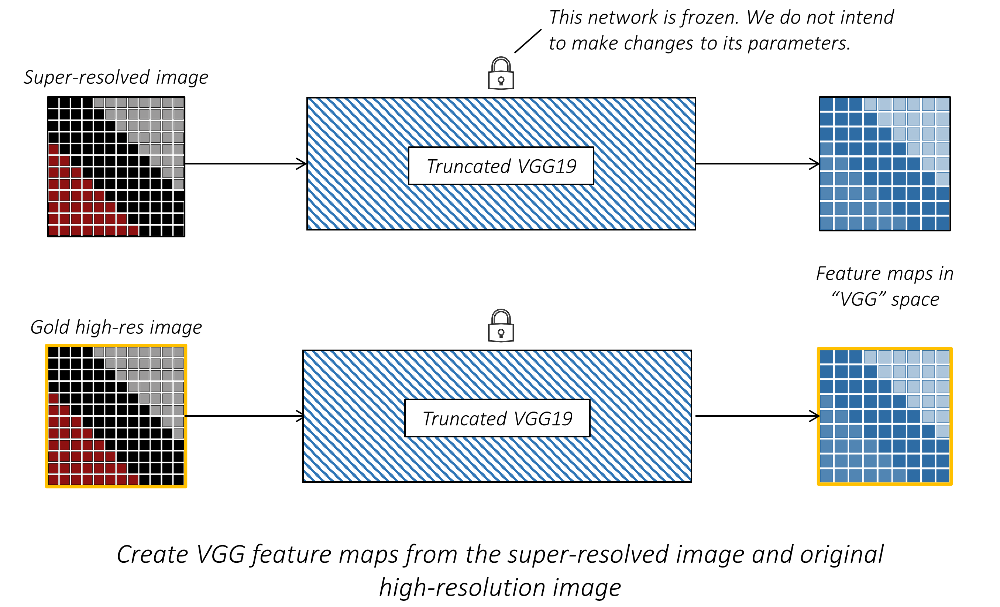
</p>

We use **MSE-based content loss in this VGG space** to compare, indirectly, the super-resolved image with the original, gold high-resolution image.

<p align="center">
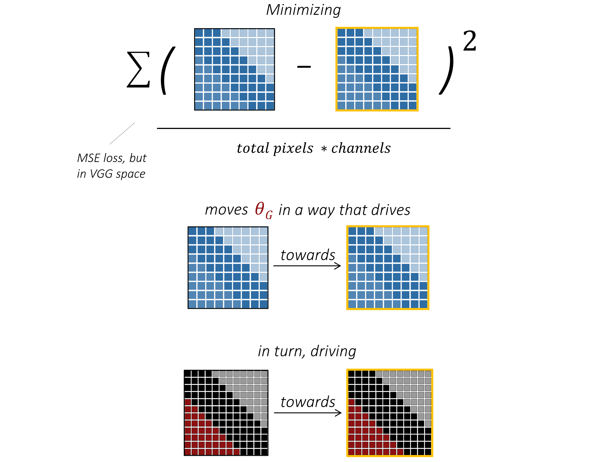
</p>

Choosing to minimize the MSE between the super-resolved and gold images in the VGG space means we will change the parameters of the generator in a way that, if given the same low-resolution image again, it will **create a super-resolved image that is closer in appearance to the original high-resolution version by virtue of being closer in appearance in the VGG space**, *without* being overly-smooth or unrealistic as in the case of the SRResNet. 

#### The Generator Update – part 2

What's a GAN without adversarial training? *Not* a GAN, is what.

The use of a content loss is only one component of a Generator update, and while we will see improvements with the use of a VGG space instead of an RGB space, the biggest contributor to photorealistic super-resolution in the Generator as opposed to the SRResNet is still likely going to be the **adversarial loss**.

Here, the super-resolved image is passed through the Discriminator (in its current state) to obtain a **probability score $P_{HR}$ for it being of natural origin**. 

<p align="center">
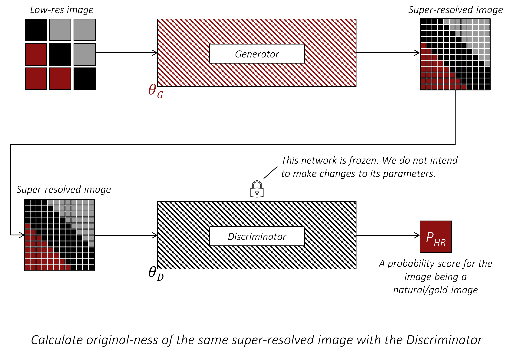
</p>

The Generator would obviously like the Discriminator to *not* realize that it is indeed *not* a natural image and for $P_{HR}$ to be as high as possible. How would we update the Generator in a way that increases $P_{HR}$? Note that our objective in this step is to train the Generator only – the Discriminator's weights are frozen.

We therefore **provide our *desired* label ($HR$) – the incorrect or misleading label –** to the binary cross-entropy loss function and use the resulting gradient information to update the Generator's weights!

<p align="center">
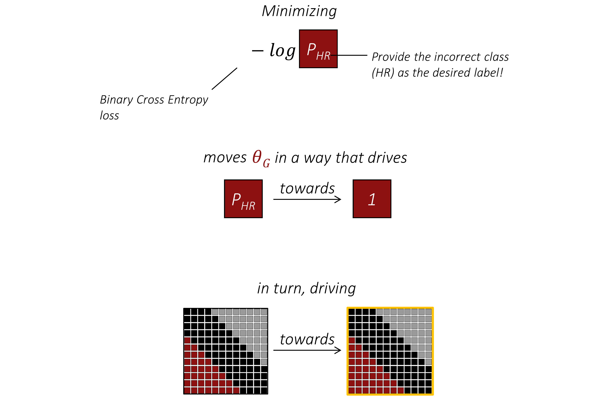
</p>

Choosing to minimize the binary cross-entropy loss with the desired but *wrong* ($HR$) label means we will change the parameters of the Generator in a way that, if given the low-resolution image again, it will **create a super-resolved image that is closer in appearance and characteristics to the original high-resolution version such that it becomes more likely for the Discriminator to identify it as being of natural origin**. 

In other words, from this loss formulation, we are using gradient information in the Discriminator – i.e. how the Discriminator's output $P_{HR}$ will respond to changes in the Discriminator's parameters – *not* to update the Discriminator's own parameters, *but rather* to acquire gradient information in the Generator via backpropagation – i.e. how the Discriminator's output $P_{HR}$ will respond to changes in the Generator's parameters – to make the necessary changes to the Generator!

[Earlier](https://github.com/sgrvinod/a-PyTorch-Tutorial-to-Super-Resolution#minimizing-loss--a-refresher) in the tutorial, we saw how we could minimize a loss function and move towards the desired output by updating only a subnetwork $n$ in a larger network $N$ by freezing the parameters of the subnetwork $N-n$. We are doing exactly the same here, with the Generator and Discriminator combining to form a supernetwork $N$, in which we are only updating the Generator $n$. No doubt the loss would be minimized to a greater extent if we also update the Discriminator $N-n$, but doing so would directly sabotage the Discriminator's discriminating abilities, which is counterproductive. 

#### Perceptual Loss

Since the Generator learns from two types of losses – content loss and adversarial loss – we can combine them using a weighted average to represent what the authors of the paper call the ***perceptual* loss**.

<p align="center">
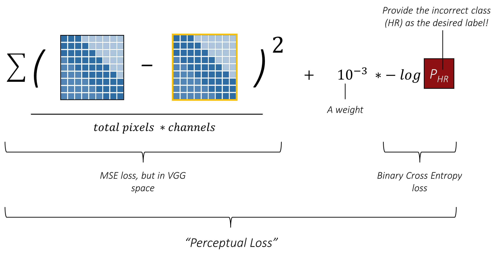
</p>

This perceptual loss vastly improves upon the capabilities of the SRResNet, with the Generator able to produce photorealistic and finely-detailed images that are much more believable, as evidenced in user studies conducted in the paper! 

# Implementation

The sections below briefly describe the implementation.

They are meant to provide some context, but **details are best understood directly from the code**, which is quite heavily commented.

### Dataset

#### Description

While the authors of the paper trained their models on a 350k-image subset of the ImageNet data, I simply used about 120k COCO images. They're a lot easier to obtain.

As in the paper, we test trained models on the Set5, Set14, and BSD100 datasets, which are commonly used benchmarks for the super-resolution task.

#### Download

You'd need to download MSCOCO '14 [Training (13GB)](http://images.cocodataset.org/zips/train2014.zip) and [Validation (6GB)](http://images.cocodataset.org/zips/val2014.zip) images. 

You can find download links to the Set5, Set14, BSD100 test datasets [here](https://github.com/XPixelGroup/BasicSR/blob/master/docs/DatasetPreparation.md#common-image-sr-datasets). In the Google Drive link, navigate to the `Image Super-Resolution/Classical` folder. Note that in the Set5 and Set14 zips, you will find multiple folders – the images you need are in the `original` folder. 

Organize images in 5 separate folders – the training images in `train2014`, `val2014`, and the testing images in `BSDS100`, `Set5`, `Set14`.

### Model Inputs and Targets

There are four inputs and targets. All input and target images are composed of RGB channels and are in the RGB space, unless otherwise noted.

#### High-Resolution (HR) Images

High-resolution images are random patches of size $96\times96$ from the training images. HR images are used as targets to train the SRResNet and Generator of the SRGAN, and as inputs to the Discriminator of the SRGAN.

When used as targets for the SRResNet, we will normalize these patches' contents to $[-1, 1]$, because this is the range in which MSE is calculated in the paper. Naturally, this means that super-resolved (SR) images must also be generated in $[-1, 1]$.

When used as targets for the Generator of the SRGAN, we will normalize these patches' contents with the mean and standard deviation of ImageNet data, which can be found [here](https://pytorch.org/vision/0.12/models.html), because the HR image will be fed to an truncated ImageNet-pretrained VGG19 network for computing MSE in VGG space.

```python
mean = [0.485, 0.456, 0.406]
std = [0.229, 0.224, 0.225]
```

When used as inputs to the the Discriminator of the SRGAN, we will do the same. Naturally, this means that the Discriminator will accept inputs that have been ImageNet-normed.

PyTorch follows the $NCHW$ convention, which means the channels dimension ($C$) will precede the size dimensions.

Therefore, **HR images are `Float` tensors of dimensions $N\times3\times96\times96$**, where $N$ is the batch size, and values are either in the $[-1, 1]$ range or ImageNet-normed.

#### Low-Resolution (LR) Images

Low-resolution versions of the HR images are produced by 4x bicubic downsampling. LR images are inputs to the SRResNet and Generator of the SRGAN.

[Depending upon the library used for downsampling](https://zuru.tech/blog/the-dangers-behind-image-resizing#qualitative-results), we may need to perform antialiasing (i.e., prevent [aliasing](https://en.wikipedia.org/wiki/Aliasing)) using a Gaussian blur as a low-pass filter before downsampling. Pillow's `resize` function, which we end up using, already incorporates antialiasing measures.

In the paper, LR images are scaled to $[0, 1]$, but we will instead normalize their contents with the mean and standard deviation of ImageNet data. Naturally, this means that inputs to our SRResNet and Generator must always be ImageNet-normed.

Therefore, **LR images are `Float` tensors of dimensions $N\times3\times16\times16$**, where $N$ is the batch size, and values are always ImageNet-normed.

#### Super-Resolved (SR) Images

Super-resolved images are the intelligently upscaled versions of the LR images. SR images are outputs of the SRResNet and Generator of the SRGAN, to be compared with the target HR images, and also used as inputs to the Discriminator of the SRGAN.

The content loss when training the SRResNet is to be computed from RGB values in the $[-1, 1]$. SR images produced by the SRResNet are therefore in the same range, achieved with a final $\tanh$ layer. 

Since the Generator of the SRGAN has the same architecture of the SRResNet, and is initially seeded with the trained SRResNet, the Generator's output will also be in $[-1, 1]$. 

Since the content loss when training the Generator is in VGG space, its SR images will need to be converted from $[-1, 1]$ to the ImageNet-normed space for input to the truncated VGG19. As mentioned earlier, the same is done with the HR images.

Therefore, **SR images are `Float` tensors of dimensions $N\times3\times96\times96$**, where $N$ is the batch size, and values are always in the range $[-1, 1]$.

#### Discriminator Labels

Since the Discriminator is a binary image classifier trained with both the SR and HR counterparts of each LR image, labels are $1$ or $0$ representing the $HR$ (natural origin) and $SR$ (artificial, Generator origin) labels respectively.

Discriminator labels are constructed manually during training – 

- a **`Long` tensor of dimensions $N$**, where $N$ is the batch size, filled with $1$s ($HR$) when training the Generator with the adversarial loss.

- a **`Long` tensor of dimensions $2N$**, where $N$ is the batch size, filled with $N$ $1$s ($HR$) and $N$ $0$s ($SR$) when training the Discriminator with the $N$ HR and $N$ SR images respectively.

### Data Pipeline

Data is divided into *training* and *test* splits. There is no *validation* split – we will simply use the hyperparameters described in the paper.

#### Parse Raw Data

See `create_data_lists()` in [`utils.py`](https://github.com/sgrvinod/a-PyTorch-Tutorial-to-Super-Resolution/blob/master/utils.py).

This parses the data downloaded and saves the following files –

- `train_images.json`, a list containing **filepaths of all training images** (i.e. the images in `train2014` and `val2014` folders) that are above a specified minimum size.

- `Set5_test_images.json`, `Set14_test_images.json`, `BSDS100_test_images.json`, each containing **filepaths of all test images** in the `Set5`, `Set14`, and `BSDS100` folders that are above a specified minimum size.

#### Image Conversions

See `convert_image()` in [`utils.py`](https://github.com/sgrvinod/a-PyTorch-Tutorial-to-Super-Resolution/blob/master/utils.py).

We will use a variety of normalizations, scaling, and representations for pixel values in RGB space –

- As **Pillow (PIL)** images – images as read by the Pillow library in Python. RGB values are stored as integers in $[0, 255]$, which is how images are read from disk.
  
- As **floating values in $[0, 1]$**, which is used as an intermediate representation while converting from one representation to another.
  
- As **floating values in $[-1, 1]$**, which is how HR images are represented, SR images are produced, and in the case of the SRResNet, the medium in which the content loss is calculated.
  
- As **ImageNet-normed values**, which is how LR, SR, HR images are input to *any* model (SRResNet, Generator, Discriminator, or truncated VGG19).
  
- As [***y-channel***](https://github.com/xinntao/BasicSR/wiki/Color-conversion-in-SR#rgbbgr----ycbcr), the luminance channel Y in the YCbCr color format, used to calculate the evaluation metrics Peak Signal-to-Noise Ratio (PSNR) and Structural Similarity Index Measure (SSIM).

Transformations from one form to another are accomplished by an intermediate transformation to $[0, 1]$.

#### Image Transforms 

See `ImageTransforms` in [`utils.py`](https://github.com/sgrvinod/a-PyTorch-Tutorial-to-Super-Resolution/blob/master/utils.py).

During training, **HR images are random fixed-size $96\times96$ crops from training images** – one random crop per image per epoch. 

During evaluation, we take the **largest possible center-crop of each test image**, such that their dimensions are perfectly divisible by the scaling factor.

**LR images are produced from HR images by 4x bicubic downsampling.** [Depending upon the library used for downsampling](https://zuru.tech/blog/the-dangers-behind-image-resizing#qualitative-results), we may need to perform antialiasing (i.e., prevent [aliasing](https://en.wikipedia.org/wiki/Aliasing)) using a Gaussian blur as a low-pass filter before downsampling. Pillow's `resize` function, which we end up using, already incorporates antialiasing measures.

HR images are converted to $[-1, 1]$ when training the SRResNet and ImageNet-normed when training the SRGAN. LR images are always ImageNet-normed.

#### PyTorch Dataset

See `SRDataset` in [`datasets.py`](https://github.com/sgrvinod/a-PyTorch-Tutorial-to-Super-Resolution/blob/master/datasets.py).

This is a subclass of PyTorch [`Dataset`](https://pytorch.org/docs/master/data.html#torch.utils.data.Dataset), used to **define our training and test datasets.** 

It needs a `__len__` method defined, which returns the size of the dataset, and a `__getitem__` method which returns the LR and HR image-pair corresponding to the `i`th image in the training or test JSON file, after performing the image transformations described above.

#### PyTorch DataLoader

The `Dataset` described above, `SRDataset`, will be used by a PyTorch [`DataLoader`](https://pytorch.org/docs/master/data.html#torch.utils.data.DataLoader) in [`train_srresnet.py`](https://github.com/sgrvinod/a-PyTorch-Tutorial-to-Super-Resolution/blob/master/train_srresnet.py),[`train_srgan.py`](https://github.com/sgrvinod/a-PyTorch-Tutorial-to-Super-Resolution/blob/master/train_srgan.py), and [`eval.py`](https://github.com/sgrvinod/a-PyTorch-Tutorial-to-Super-Resolution/blob/master/eval.py) to **create and feed batches of data to the models** for training or evaluation.

### Convolutional Block

See `ConvolutionalBlock` in [`models.py`](https://github.com/sgrvinod/a-PyTorch-Tutorial-to-Super-Resolution/blob/master/models.py).

This is a custom layer consisting of a **2D convolution**, an optional **batch-normalization**, and an optional ***Tanh***, ***PReLU***, or **Leaky *ReLU* activation**, used as a fundamental building block in the SRResNet, Generator, and Discriminator networks.

### Sub-Pixel Convolutional Block

See `SubPixelConvolutionalBlock` in [`models.py`](https://github.com/sgrvinod/a-PyTorch-Tutorial-to-Super-Resolution/blob/master/models.py).

This is a custom layer consisting of a **2D convolution to $s^2n$ channels**, where $s$ is the scaling factor, and $n$ is the desired output channels in the upscaled image, followed by a **PyTorch [`nn.PixelShuffle()`](https://pytorch.org/docs/stable/generated/torch.nn.PixelShuffle.html#torch.nn.PixelShuffle)**, used to perform upscaling in the SRResNet and Generator networks.

### Residual Block

See `ResidualBlock` in [`models.py`](https://github.com/sgrvinod/a-PyTorch-Tutorial-to-Super-Resolution/blob/master/models.py).

This is a custom layer consisting of two convolutional blocks. The first convolutional block is *PReLU*-activated, and the second isn't activated at all. Batch normalization is performed in both. A **residual (skip) connection is applied** across the two convolutional blocks.

### SRResNet

See `SRResNet` in [`models.py`](https://github.com/sgrvinod/a-PyTorch-Tutorial-to-Super-Resolution/blob/master/models.py).

This **constructs the SRResNet**, [as described](https://github.com/sgrvinod/a-PyTorch-Tutorial-to-Super-Resolution#the-srresnet-architecture), using convolutional, residual, and sub-pixel convolutional blocks. 

### Generator

See `Generator` in [`models.py`](https://github.com/sgrvinod/a-PyTorch-Tutorial-to-Super-Resolution/blob/master/models.py).

The Generator of the SRGAN has the **same architecture as the SRResNet**, [as described](https://github.com/sgrvinod/a-PyTorch-Tutorial-to-Super-Resolution#the-srresnet-architecture), and need not be constructed afresh.

### Discriminator

See `Discriminator` in [`models.py`](https://github.com/sgrvinod/a-PyTorch-Tutorial-to-Super-Resolution/blob/master/models.py).

This **constructs the Discriminator of the SRGAN**, [as described](https://github.com/sgrvinod/a-PyTorch-Tutorial-to-Super-Resolution#the-discriminator-architecture), using convolutional blocks and linear layers. 

An *optional* [`nn.AdaptiveAvgPool2d`](https://pytorch.org/docs/stable/generated/torch.nn.AdaptiveAvgPool2d.html) maintains a fixed image size before it is flattened and passed to the linear layers – this is only required if we don't use the default $96\times96$ HR/SR image size during training.

### Truncated VGG19

See `TruncatedVGG19` in [`models.py`](https://github.com/sgrvinod/a-PyTorch-Tutorial-to-Super-Resolution/blob/master/models.py).

This **truncates an ImageNet-pretrained VGG19 network**, [available in `torchvision`](https://pytorch.org/vision/0.12/models.html), such that its output is the "feature map obtained by the $j$th convolution (after activation) before the $i$th maxpooling layer within the VGG19 network", as described in the paper.

As the authors do, we will use $i=5$ and $j=4$.

# Training

Before you begin, make sure to save the required data files for training and evaluation. To do this, run the contents of [`create_data_lists.py`](https://github.com/sgrvinod/a-PyTorch-Tutorial-to-Super-Resolution/blob/master/create_data_lists.py) after pointing it to the training data folders `train2014`, `val2014`, and test data folders `Set5`, `Set14`, `BSDS100` folders after you [download the data](https://github.com/sgrvinod/a-PyTorch-Tutorial-to-Super-Resolution#download) –

`python create_data_lists.py`

### Train the SRResNet

See [`train_srresnet.py`](https://github.com/sgrvinod/a-PyTorch-Tutorial-to-Super-Resolution/blob/master/train_srresnet.py).

The parameters for the SRResNet (and training it) are at the beginning of the file, so you can easily check or modify them should you need to.

To train the SRResNet **from scratch**, run this file –

`python train_srresnet.py`

To resume training **from a checkpoint**, point to the corresponding file with the `checkpoint` parameter at the beginning of the code.

### Train the SRGAN

See [`train_srgan.py`](https://github.com/sgrvinod/a-PyTorch-Tutorial-to-Super-Resolution/blob/master/train_srgan.py).

You can train the SRGAN only after training the SRResNet as the trained SRResNet checkpoint is used to initialize the SRGAN's Generator.

The parameters for the model (and training it) are at the beginning of the file, so you can easily check or modify them should you need to.

To train the SRGAN **from scratch**, run this file –

`python train_srgan.py`

To resume training **from a checkpoint**, point to the corresponding file with the `checkpoint` parameter at the beginning of the code.

### Remarks

We use the hyperparameters recommended in the paper.

For the SRResNet, we train using the Adam optimizer with a learning rate of $10^{-4}$ for $10^6$ iterations with a batch size of $16$.

The SRGAN is also trained with the Adam optimizer, with a learning rate of $10^{-4}$ for $10^5$ iterations and a learning rate of $10^{-5}$ for an *additional* $10^5$ iterations, with a batch size of $16$. 

I trained with a single RTX 2080Ti GPU. 

### Model Checkpoints

You can download my pretrained models [here](https://drive.google.com/drive/folders/12OG-KawSFFs6Pah89V4a_Td-VcwMBE5i?usp=sharing).

Note that these checkpoint should be [loaded directly with PyTorch](https://pytorch.org/docs/stable/generated/torch.load.html#torch.load) for evaluation or inference – see below.

# Evaluation

See [`eval.py`](https://github.com/sgrvinod/a-PyTorch-Tutorial-to-Super-Resolution/blob/master/eval.py).

To evaluate the chosen model, run the file –

`python eval.py`

This will calculate the Peak Signal-to-Noise Ratio (**PSNR**) and Structural Similarity Index Measure (**SSIM**) evaluation metrics on the 3 test datasets for the chosen model.

Here are my results (with the paper's results in parantheses):

|              |      PSNR      |      SSIM      |       |      PSNR      |      SSIM      |       |      PSNR      |      SSIM      |
| :----------: | :------------: | :------------: | :---: | :------------: | :------------: | :---: | :------------: | :------------: |
| **SRResNet** | 31.927 (32.05) | 0.902 (0.9019) |       | 28.588 (28.49) | 0.799 (0.8184) |       | 27.587 (27.58) | 0.756 (0.7620) |
|  **SRGAN**   | 29.719 (29.40) | 0.859 (0.8472) |       | 26.509 (26.02) | 0.729 (0.7397) |       | 25.531 (25.16) | 0.678 (0.6688) |
|              |    **Set5**    |    **Set5**    |       |   **Set14**    |   **Set14**    |       |   **BSD100**   |   **BSD100**   |

Erm, huge grain of salt. The paper emphasizes repeatedly that PSNR and SSIM _aren't really_ an indication of the quality of super-resolved images. The less realistic and overly smooth SRResNet images score better than those from the SRGAN. This is why the authors of the paper conduct an opinion score test, which is obviously beyond our means here.

# Inference

See [`super_resolve.py`](https://github.com/sgrvinod/a-PyTorch-Tutorial-to-Super-Resolution/blob/master/super_resolve.py).

Make sure to both the trained SRResNet and SRGAN checkpoints at the beginning of the code.

Run the `visualize_sr()` function with your desired HR image to **visualize results in a grid**, with the original HR image, the bicubic-upsampled image (as a proxy for the LR version of this image), the super-resolved image from the SRResNet, and the super-resolved image from the SRGAN. 

The examples at the beginning of this tutorial were generated using this function. Note that this does not upscale the chosen image, but rather **downscales and then super-resolves to compare with the original HR image**. You will need to modify the code if you wish to upscale the provided image directly, or perform any other function.

**Be mindful of the size of the provided image.** The function provides a `halve` parameter, if you wish to create a new HR image at half the dimensions. This might be required if the original HR image is larger than your screen's size, making it impossible for you to experience the 4x super-resolution. 

For instance, for a 2160p HR image, the LR image will be of 540p (2160p/4) resolution. On a 1080p screen, you will essentially be looking at a comparison between a 540p LR image (in the form of its bicubically upscaled version) and 1080p SR/HR images because your 1080p screen can only display the 2160p SR/HR images at a downsampled 1080p. This is only an *apparent* rescaling of 2x. With `halve = True`, the HR/SR images will be at 1080p and the LR image at 270p.

### Large Examples

The images in the following examples (from [Cyberpunk 2077](https://www.cyberpunk.net/in/en/)) are quite large. If you are viewing this page on a 1080p screen, you would need to **click on the image to view it at its actual size** to be able to effectively see the 4x super-resolution.


<p align="center">
  <i>Click on image to view at full size.</i>
</p>


---

<p align="center">
  <i>Click on image to view at full size.</i>
</p>


---

<p align="center">
  <i>Click on image to view at full size.</i>
</p>


---

<p align="center">
  <i>Click on image to view at full size.</i>
</p>

<p align="center">

</p>

---

<p align="center">
  <i>Click on image to view at full size.</i>
</p>

<p align="center">

</p>

---

<p align="center">
  <i>Click on image to view at full size.</i>
</p>


---

# Frequently Asked Questions

I will populate this section over time from common questions asked in the [*Issues*](https://github.com/sgrvinod/a-PyTorch-Tutorial-to-Super-Resolution/issues) section of this repository.

**Why are super-resolved (SR) images from the Generator passed through the Discriminator twice? Why not simply *reuse* the output of the Discriminator from the first time?**

Yes, we do discriminate SR images *twice* –

- When training the Generator, we pass SR images through the Discriminator, and use the Discriminator's output in the adversarial loss function with the incorrect but desired $HR$ label.

- When training the Discriminator, we pass SR images through the Discriminator, and use the Discriminator's output to calculate the binary cross entropy loss with the correct and desired $SR$ label.

In the first instance, our goal is to update the parameters $\theta_G$ of the Generator using the gradients of the loss function with respect to $\theta_G$. And indeed, the Generator *is* a part of the computational graph over which we backpropagate gradients. 

In the second instance, our goal is to update only the parameters $\theta_D$ of the Discriminator, which are *upstream* of $\theta_G$ in the *backwards* direction as we backpropagate gradients.

In other words, it is not necessary to calculate the gradients of the loss function with respect to $\theta_G$ when training the Discriminator, and there is *no* need for the Generator to be a part of the computational graph! Having it so would be expensive because backpropagation is expensive. Therefore, we *detach* the SR images from the computational graph in the second instance, causing it to become, essentially, an independent variable with no memory of the computational graph (i.e. the Generator) that led to its creation.

This is why we forward-propagate twice – once with the SR images a part of the full SRGAN computational graph, *requiring* backpropagation across the Generator, and once with the SR images detached from the Generator's computational graph, *preventing* backpropagation across the Generator. 

Forward-propagating twice is *much* cheaper than backpropagating twice.

**How does subpixel convolution compare with transposed convolution?**

They seem rather similar to me, and should be able to achieve similar results. 

They can be mathematically equivalent if, for a desired upsampling factor $s$, and a kernel size $k$ used in the subpixel convolution, the kernel size for the transposed convolution is $sk$. The number of parameters in this case will also be the same – $ns^2 * i * k * k$ for the former and $n * i * sk * sk$ for the latter. 

However, there are indications from some people that subpixel convolution *is* superior in particular ways, although I do not understand why. See this [paper](https://arxiv.org/pdf/1609.07009.pdf), this [repository](https://github.com/atriumlts/subpixel), and this [Reddit thread](https://www.reddit.com/r/MachineLearning/comments/n5ru8r/d_subpixel_convolutions_vs_transposed_convolutions/). Perhaps the [original paper](https://arxiv.org/pdf/1609.05158.pdf) too.

Obviously, being mathematically equivalent does not mean they are optimizable or learnable or efficient in the same way, but if anyone can knows *why* subpixel convolution can yield superior results, please open an issue and let me know so I can add this information to this tutorial.
