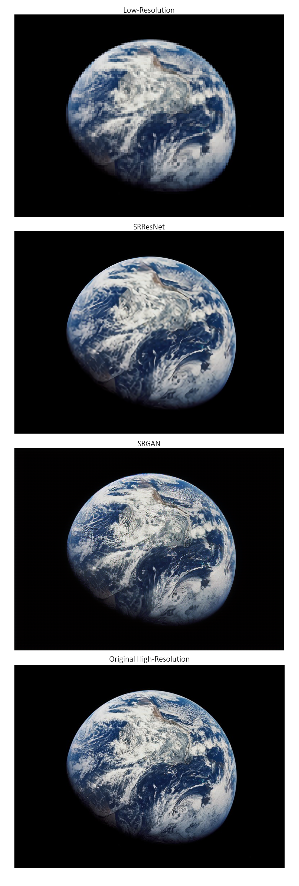
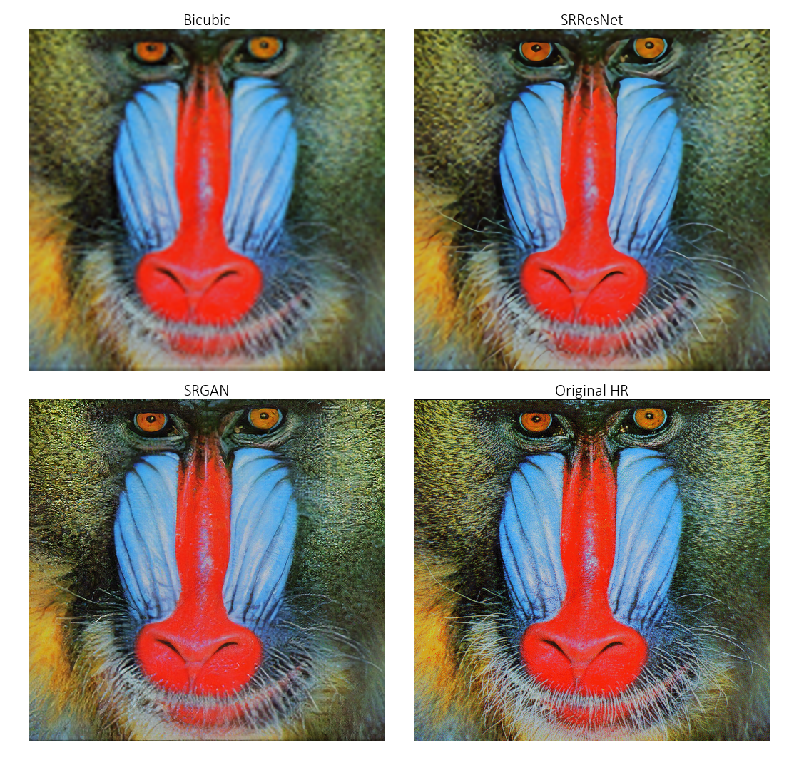
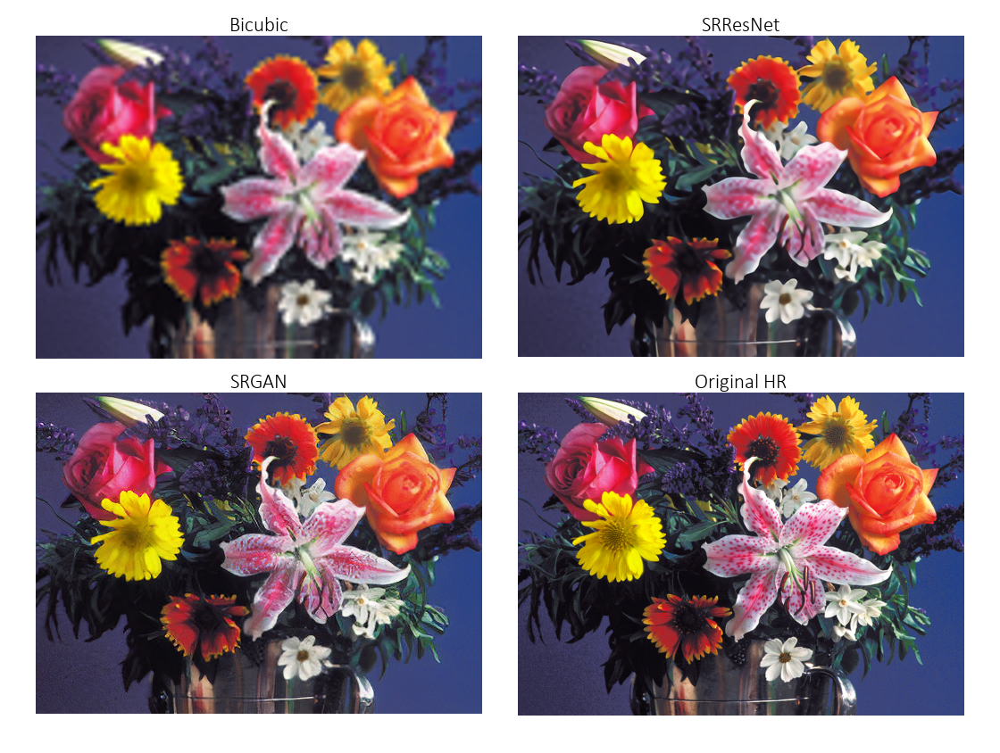
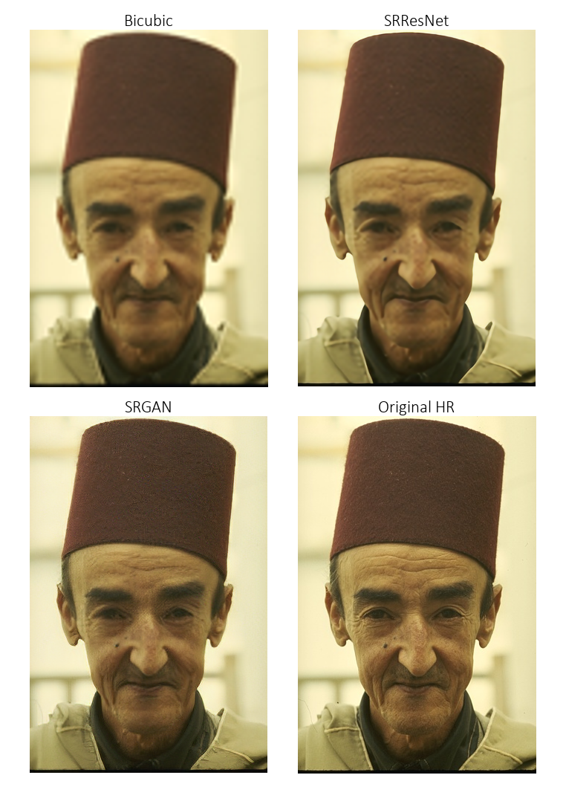
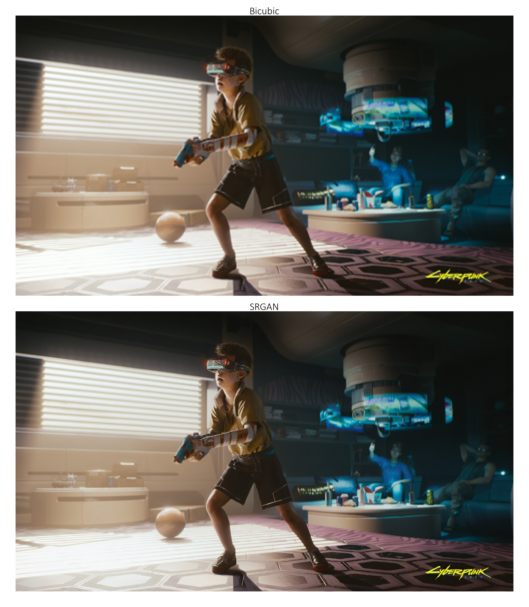
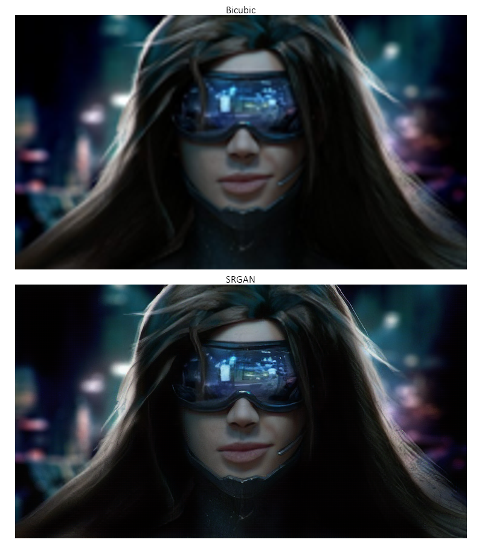
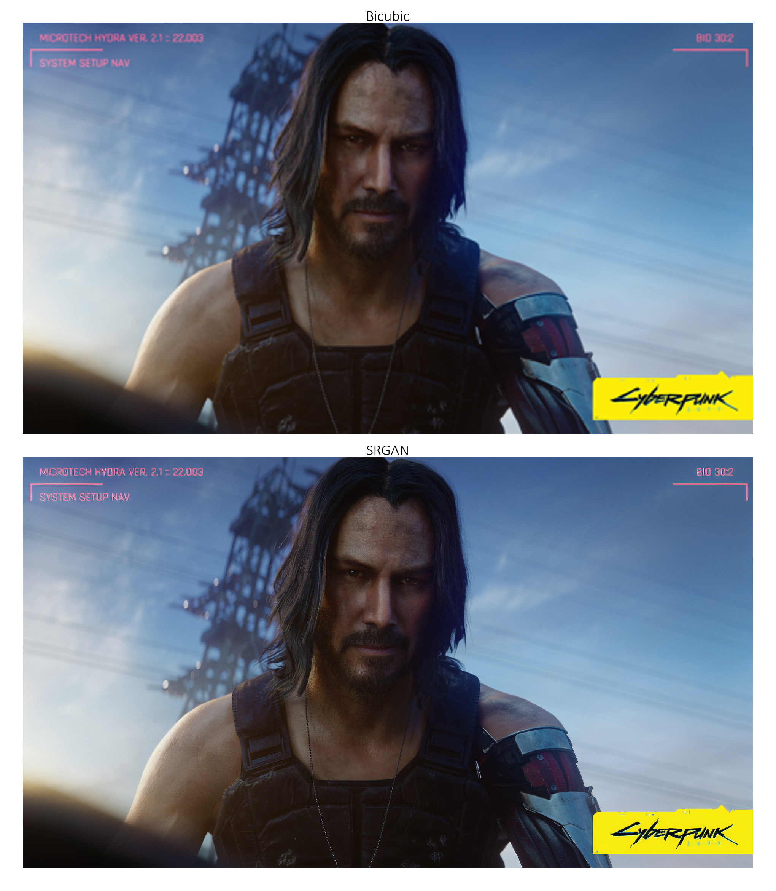

This is a **[PyTorch](https://pytorch.org) Tutorial to Super-Resolution**.

This is the fifth in [a series of tutorials](https://github.com/sgrvinod/Deep-Tutorials-for-PyTorch) I'm writing about _implementing_ cool models on your own with the amazing PyTorch library.

Basic knowledge of PyTorch, convolutional neural networks is assumed.

If you're new to PyTorch, first read [Deep Learning with PyTorch: A 60 Minute Blitz](https://pytorch.org/tutorials/beginner/deep_learning_60min_blitz.html) and [Learning PyTorch with Examples](https://pytorch.org/tutorials/beginner/pytorch_with_examples.html).

Questions, suggestions, or corrections can be posted as issues.

I'm using `PyTorch 1.4` in `Python 3.6`.

---

**27 Jan 2020**: Code is now available for [a PyTorch Tutorial to Machine Translation](https://github.com/sgrvinod/a-PyTorch-Tutorial-to-Machine-Translation).

---

# Contents

[***Objective***](https://github.com/sgrvinod/a-PyTorch-Tutorial-to-Super-Resolution#objective)

[***Concepts***](https://github.com/sgrvinod/a-PyTorch-Tutorial-to-Super-Resolution#tutorial-in-progress)

[***Overview***](https://github.com/sgrvinod/a-PyTorch-Tutorial-to-Super-Resolution#tutorial-in-progress)

[***Implementation***](https://github.com/sgrvinod/a-PyTorch-Tutorial-to-Super-Resolution#tutorial-in-progress)

[***Training***](https://github.com/sgrvinod/a-PyTorch-Tutorial-to-Super-Resolution#tutorial-in-progress)

[***Inference***](https://github.com/sgrvinod/a-PyTorch-Tutorial-to-Super-Resolution#tutorial-in-progress)

[***Frequently Asked Questions***](https://github.com/sgrvinod/a-PyTorch-Tutorial-to-Super-Resolution#tutorial-in-progress)

# Objective

**To build a model that can realistically increase image resolution.**

Super-resolution (SR) models essentially hallucinate new pixels where previously there were none. In this tutorial, we will try to _quadruple_ the dimensions of an image i.e. increase the number of pixels by 16x!

We're going to be implementing [_Photo-Realistic Single Image Super-Resolution Using a Generative Adversarial Network_](https://arxiv.org/abs/1609.04802). It's not just that the results are very impressive... it's also a great introduction to GANs!

We will train the two models described in the paper — the SRResNet, and the SRGAN which greatly improves upon the former through adversarial training.  

Before you proceed, take a look at some examples generated from low-resolution images not seen during training. _Enhance!_

---

---

---

---

---
[A **video demo** for the SRGAN!](https://youtu.be/sUhbIdSd6dc)

Since YouTube's compression is likely reducing the video's quality, you can [download the original video file here](https://drive.google.com/drive/folders/12OG-KawSFFs6Pah89V4a_Td-VcwMBE5i?usp=sharing) for best viewing.

Make sure to watch in 1080p so that the 4x scaling is not downsampled to a lower value.

---

There are large examples at the [end of the tutorial](https://github.com/sgrvinod/a-PyTorch-Tutorial-to-Super-Resolution#some-more-examples).

---

# Tutorial in Progress

I am still writing this tutorial.

In the meantime, **you could take a look at the code** – it works!

Model checkpoints are available [here](https://drive.google.com/drive/folders/12OG-KawSFFs6Pah89V4a_Td-VcwMBE5i?usp=sharing).

While the authors of the paper trained their models on a 350k-image subset of the ImageNet data, I simply used about 120k COCO images (_train2014_ and _val2014_ folders). They're a lot easier to obtain. If you wish to do the same, you can download them from the links listed in [my other tutorial](https://github.com/sgrvinod/a-PyTorch-Tutorial-to-Image-Captioning#dataset).

Here are the results (with the paper's results in parantheses):

||PSNR|SSIM||PSNR|SSIM||PSNR|SSIM|
|:---:|:---:|:---:|:---:|:---:|:---:|:---:|:---:|:---:|
|**SRResNet**|31.927 (32.05)|0.902 (0.9019)||28.588 (28.49)|0.799 (0.8184)||27.587 (27.58)|0.756 (0.7620)|
|**SRGAN**|29.719 (29.40)|0.859 (0.8472)||26.509 (26.02)|0.729 (0.7397)||25.531 (25.16)|0.678 (0.6688)|
||**Set5**|**Set5**||**Set14**|**Set14**||**BSD100**|**BSD100**|

Erm, huge grain of salt. The paper emphasizes repeatedly that PSNR and SSIM _aren't really_ an indication of the quality of super-resolved images. The less realistic and overly smooth SRResNet images score better than those from the SRGAN. This is why the authors of the paper conduct an opinion score test, which is obviously beyond our means here.

### Large examples

The images in the following examples (from [Cyberpunk 2077](https://www.cyberpunk.net/in/en/)) are quite large. If you are viewing this page on a 1080p screen, you would need to **click on the image to view it at its actual size** to be able to effectively see the 4x super-resolution.

  <i>Click on image to view at full size.</i>

---

  <i>Click on image to view at full size.</i>

---

  <i>Click on image to view at full size.</i>

---

  <i>Click on image to view at full size.</i>

---

  <i>Click on image to view at full size.</i>

---

  <i>Click on image to view at full size.</i>

---
